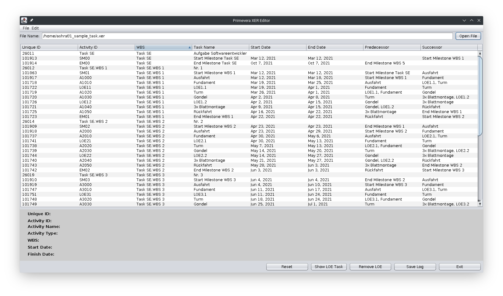
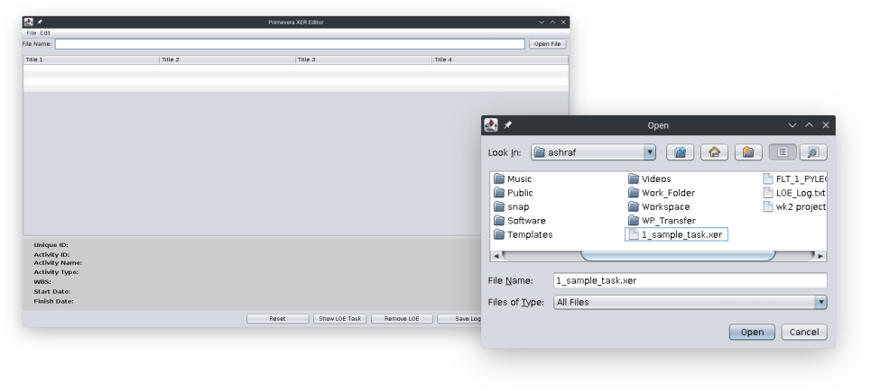
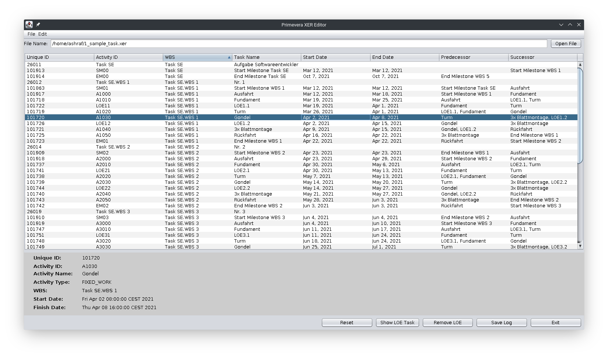
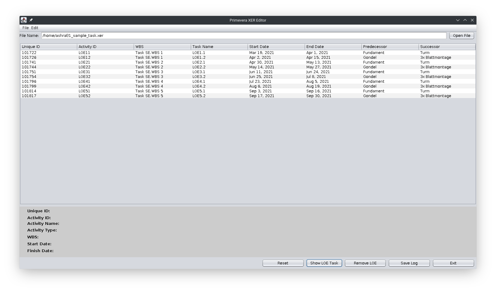
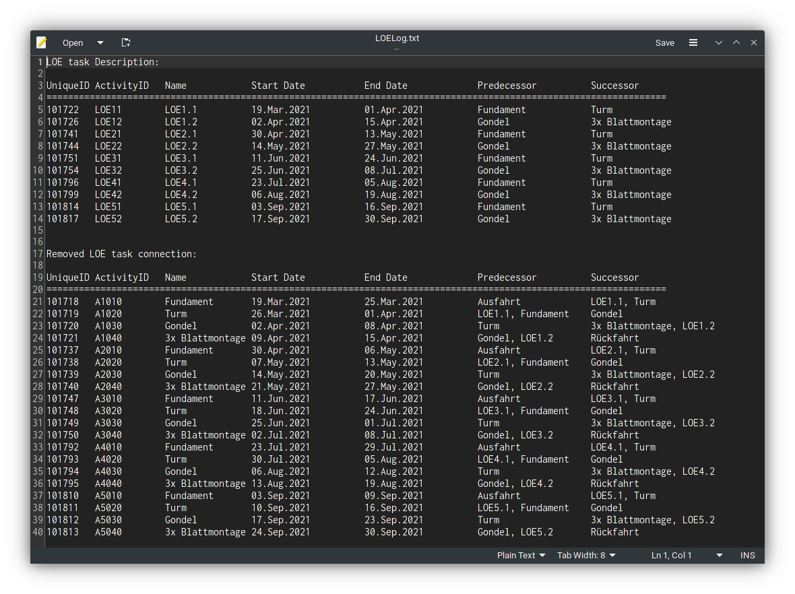

# Primevera XER Editor

A GUI tool for reading and analyzing Primavera P6 project management file. It provides multiple functionality and implementation of reading and editing project management files. This project is implemented in java and used swing for UI.

#### Features:

- Reading and displaying project file
- Detecting individual tasks and displaying them in the details pane
- Sorting task based on criteria
- Filtering individual task (ie. LOE task)
- Deleting filtered tasks
- Saving log with relationship information


Oracle’s **Primavera P6 Enterprise Project Portfolio Management** is the most powerful, robust, and easy-to-use solution for prioritizing, planning, managing, and evaluating projects, programs, and portfolios. It provides the solution for managing projects of any size, adapts to varying levels of complexity across projects, and intelligently scales to meet the needs of all roles, functions, or skill levels in any organization and project team.

Primavera lets users plan resources more accurately, track how one or all of the projects are progressing against the plans, and mitigate risk by intervening rapidly if problems arise. And with an intuitive, role-based interface, each project team member receives the information they need, while executives have a bird’s eye view of how all projects are doing from cost, completion, and other viewpoints. With everyone on the same page, users can coordinate the whole project lifecycle from idea to execution.

Primavera is developed by Oracle and provides the capability of complete project planning and finds its applications in several practical fields such as oil and gas, construction, manufacturing, etc. It helps project managers plan, schedule, and control large-scale programs and individual projects by integrating with financial management and human capital management systems.

#### Some of the benefits are:

- Balance resource capacity
- Plan, schedule, and control complex projects
- Allocate best resources and track progress
- Monitor and visualize project performance versus plan
- Conduct what-if analysis and analyze alternative project plans

##### 

#### What is a XER file?

The XER file format is a proprietary project file format used by **Primavera P6** project planning and management application. This file format stores data related to project planning such as tasks, resources, timelines, and materials. 

#### XER File Format

An XER file is a text file and can be opened with a text editor. Though project-related data can be viewed by opening it in a text editor, it is hard for one to understand it by manually establishing the links. It is divided into multiple tables and key values. The format offers a low level of data control that is being imported from other formats. It the most used format to exchange data with other P6 databases. Certain advantages that XER has on equivalent XML format include the ability to move global codes and calendars to project level and map codes, UDFs, resources, and calendars to existing values.

#### MPXJ Library

[MPXJ library](http://www.mpxj.org/) is based around a set of data structures which follow the way schedule data is represented by Microsoft Project. All manipulation of project data takes place using these data structures, which can be read from or written to the various supported file formats. 

This library provides a set of facilities to allow project information to be manipulated from a number of different programming languages. MPXJ supports a range of data formats: Microsoft Project Exchange (MPX), Microsoft Project (MPP, MPT), Microsoft Project Data Interchange (MSPDI XML), Microsoft Project Database (MPD), Planner (XML), Primavera P6 (PMXML, XER, and database), Primavera P3 (PRX and database), SureTrak (STX and database), Asta Powerproject and Easyplan (PP, MDB), Phoenix Project Manager (PPX), FastTrack Schedule (FTS), GanttProject (GAN), TurboProject (PEP), ConceptDraw PROJECT (CDPX, CPDZ and CPDTZ), Synchro Scheduler (SP) and the Standard Data Exchange Format (SDEF).

Primavera P6 is an industry-leading tool favoured by users with complex planning requirements. It can export project data in the form of XER or PMXML files, both of which MPXJ can read. It is also possible for MPXJ to connect directly to the P6 database via JDBC to read project data. MPXJ can also write PMXML files to allow data to be exported in a form which can be consumed by P6. The PMXML schema forms part of the P6 distribution media, which can be downloaded from the Oracle e-Delivery site.

The XER file format has been written by Primavera P6. Although an XML file format (PMXML) is now also supported, the XER file format is still widely used.

#### Main Window




#### Opening XER file form UI



#### Reading XER files

The simplest way to read an XER file is to use the `UniversalProjectReader`:

```java
import net.sf.mpxj.ProjectFile; 
import net.sf.mpxj.reader.UniversalProjectReader; 
... 
UniversalProjectReader reader = new UniversalProjectReader(); 
ProjectFile project = reader.read("my-sample.xer");
```

By default MPXJ assumes that XER files are encoded using Windows-1252. The `UniversalProjectReader` understands Unicode Byte Order Marks (BOM) and will adjust the encoding appropriately if a BOM is present. 

Two methods are provided to do this: `setCharset` and `setEncoding`. The `setCharset` method takes an instance of the `Charset` class, while the `setEncoding` method takes the name of an encoding. 

Examples of these methods are shown below:

```java
import net.sf.mpxj.ProjectFile;
import net.sf.mpxj.primavera.PrimaveraXERFileReader;

...

PrimaveraXERFileReader reader = new PrimaveraXERFileReader();

// Use a Charset instance
reader.setCharset(Charset.forName("GB2312"));
ProjectFile project = reader.read("my-sample.xer");

// Use an encoding name
reader.setEncoding("GB2312");
project = reader.read("my-sample.xer");
```

#### Details Pane



#### User Defined Fields

MPXJ attempts to map user defined fields from P6 to the custom fields. When MPXJ reads user defined fields from the XER file, it will assign each new user defined field to a new custom attribute. For example when the first custom text field is read, it will be stored in TEXT1, the next custom text field will be stored in TEXT2, and so on.

```java
import net.sf.mpxj.ProjectFile;
import net.sf.mpxj.primavera.PrimaveraXERFileReader;

...

PrimaveraXERFileReader reader = new PrimaveraXERFileReader();
reader.setFieldNamesForTaskUdfType(UserFieldDataType.FT_TEXT, "ENTERPRISE_TEXT", "TEXT");
reader.setFieldNamesForResourceUdfType(UserFieldDataType.FT_START_DATE, "DATE");
reader.setFieldNamesForAssignmentUdfType(UserFieldDataType.FT_END_DATE, "DATE");
ProjectFile file = reader.read("my-sample.xer");
```

#### Filetering LOE Tasks

In the Enterprise Project Portfolio Management Tool Primavera P6 a task can have the activity type **Level of Effort (LoE)**. Tasks with this activity type are listed in the project plan but have no impact on its duration. Because of this, all tasks that correspond to the activity type LoE can be filtered out of a read-in project plan and be removed. Also, the relations to and from a LoE task must be deleted.



#### Removing LOE Tasks


#### Reading Additional Attributes

A data-driven approach is used to extract the attributes used by MPXJ from the XER file. Users can change the way attributes are read from the file, or add support for additional attributes. This assumes that you know the column name of the attributes user wants to work within the XER file. To make changes user will need to retrieve the maps which define which MPXJ attributes are used to store which columns from the XER file:

```java
PrimaveraXERFileReader reader = new PrimaveraXERFileReader();
Map<FieldType, String> resourceFieldMap = reader.getResourceFieldMap();
Map<FieldType, String> wbsFieldMap = reader.getWbsFieldMap();
Map<FieldType, String> activityFieldMap = reader.getActivityFieldMap();
Map<FieldType, String> assignmentFieldMap = reader.getAssignmentFieldMap();
```

#### Saving Log File



#### Write MPX files

Versions of Microsoft Project up to Project 98 could read and write MPX files as a data interchange format. Versions of Project after Project 98 until Project 2010 can only read MPX files. Versions of Microsoft Project after 2010 cannot read MPX files. Other third party project planning applications continue to use MPX as a data interchange format.

The sample code below illustrates how to write data to an MPX file.

```java
import net.sf.mpxj.ProjectFile;
import net.sf.mpxj.mpx.MPXWriter;

// ...

MPXWriter writer = new MPXWriter();
writer.write(projectFile, outputFileName);
```

#### Unit Testing with JUnit 5

A unit test is a piece of code written by a developer that executes a specific functionality in the code to be tested and asserts a certain behavior or state. The percentage of code which is tested by unit tests is typically called *test coverage*. A unit test targets a small unit of code, e.g., a method or a class. External dependencies should be removed from unit tests, e.g., by replacing the dependency with a test implementation or a (mock) object created by a test framework. 

| Resource files used in test |
| --------------------------- |
| MainUI.java                 |
| XERDataModel.java           |

#### Build Information

| Field         | Value              |
| ------------- | ------------------ |
| GroupId       | com.ashraf         |
| ArtifactId    | PrimeveraXEREditor |
| Version       | 1.0-SNAPSHOT       |
| Type          | jar                |
| Java Version  | 1.8                |
| Maven Version | 3.6.3              |
| net.sf.mpxj   | 9.1.0              |
| junit.jupiter | 5.6.0              |
